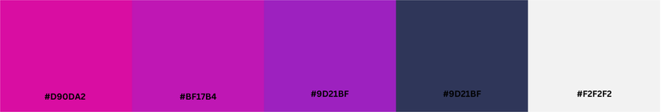
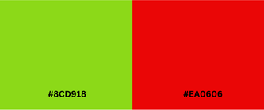
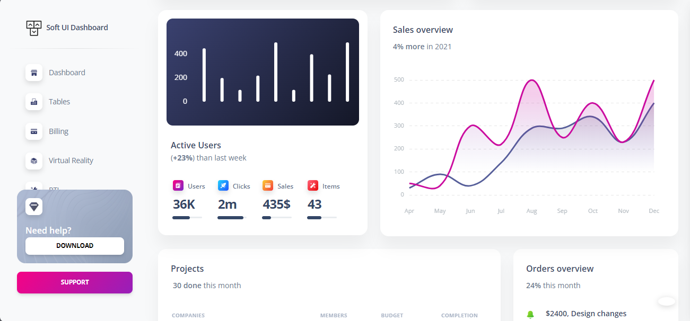
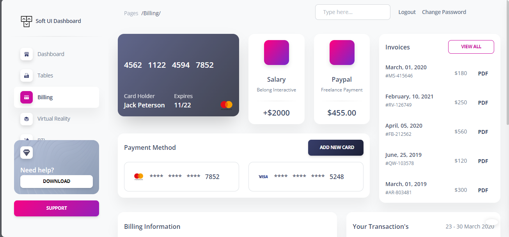
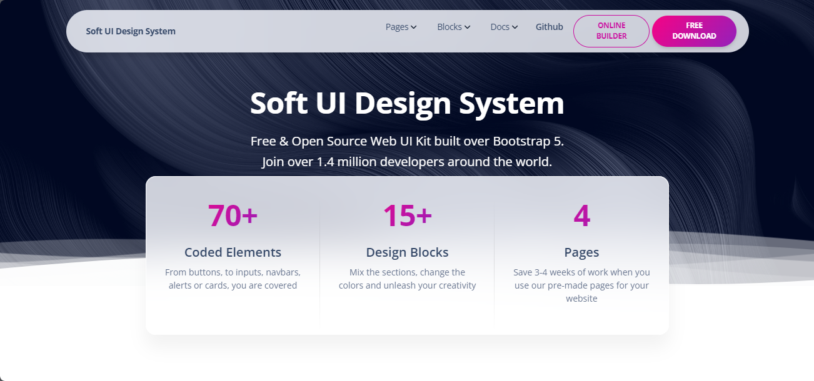
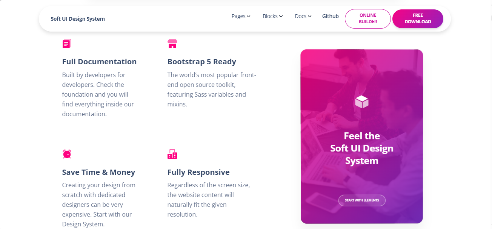

# Guia de Estilo de UI/UX

O propósito desta documentação é fornecer diretrizes abrangentes e estruturadas para a seleção e aplicação de cores, tipografia e bibliotecas no projeto. O objetivo é garantir que todos os elementos visuais sejam visualmente atraentes e atendam aos padrões de qualidade e acessibilidade estabelecidos.

## Paleta de Cores

Para o desenvolvimento do site, foi selecionada uma paleta de cores análogas, complementada por uma cor adicional para aumentar o contraste. Essa combinação utiliza três cores vizinhas no círculo cromático, proporcionando uma harmonia visual suave, enquanto a cor complementar cria um contraste mais acentuado.

    
    

A paleta abrange uma gama de tons que variam desde o rosa, passando pelo roxo, até o azul, complementados por nuances de branco. As cores selecionadas são:

- **#D90DA2 (Rosa) e #BF17B4, #9D21BF (Roxo):** Aplicadas a botões e elementos visuais que exigem maior destaque. Variantes mais claras ou escuras dessas tonalidades podem ser utilizadas conforme necessário, mantendo a coerência dentro da paleta proposta.
- **#2F3659 (Azul):** Ideal para textos, proporcionando contraste adequado e assegurando legibilidade em diversos fundos.
- **#F2F2F2 (Branco):** Utilizado como cor de fundo, o branco oferece uma base neutra, equilibrando as cores vibrantes da paleta e garantindo clareza e foco nos elementos destacados.
- **#8CD918 (Verde) e #EA0606 (Vermelho):** Utilizadas para detalhes que exigem alto contraste e atenção visual.

As escolhas de cores foram cuidadosamente avaliadas para garantir conformidade com as diretrizes de acessibilidade, assegurando que todos os usuários tenham uma experiência visual adequada. Testes de acessibilidade foram realizados com base nas diretrizes WCAG (Web Content Accessibility Guidelines) para garantir que o design atenda aos padrões recomendados.

## Tipografia

A tipografia **"Open Sans"** foi selecionada para o projeto devido às suas características de legibilidade e versatilidade. Esta fonte sans-serif é amplamente reconhecida por seu design limpo e moderno, o que a torna ideal para uma ampla gama de aplicações digitais.

## Bibliotecas e Frameworks

### Biblioteca Utilizada:
- **Bootstrap v5.0.2**

A escolha do Bootstrap visa não apenas acelerar o processo de desenvolvimento, mas também assegurar a criação de um produto final com uma interface consistente, acessível e visualmente atraente.

### Razões para a Escolha do Bootstrap:
- `Conjunto Completo de Componentes:` O Bootstrap oferece uma ampla gama de componentes e estilos prontos, incluindo paletas de cores, tipografia, botões e muito mais. Este conjunto abrangente facilita a criação de interfaces coesas e funcionais, eliminando a necessidade de desenvolvimento do zero.

- `Documentação Detalhada:` A biblioteca possui uma documentação extensa e bem organizada, que fornece orientações claras e suporte durante o desenvolvimento, reduzindo o tempo necessário para entender e implementar suas funcionalidades.

- `Grande Comunidade de Suporte:` Com uma vasta comunidade de desenvolvedores, o Bootstrap oferece uma rica base de recursos, incluindo tutoriais, fóruns e plugins. Essa ampla rede de suporte contribui para a resolução rápida de problemas e a troca de conhecimentos.

- `Facilidade de Implementação:` A facilidade de uso do Bootstrap é ideal para projetos que exigem resultados rápidos com menos configuração. Essa vantagem acelera o desenvolvimento e garante uma entrega eficiente.

## Diretrizes e Regras de Estilo

As diretrizes a seguir visam assegurar uma aplicação consistente e acessível das cores selecionadas no projeto, respeitando as variações tonais permitidas:

### Paleta de Cores Principal:

#### 1. #D90DA2 (Rosa), #BF17B4 e #9D21BF (Roxo):
- **Aplicação:** Devem ser usadas para elementos que exigem destaque, como botões, ícones de ação e outros elementos interativos.
- **Variações:** Podem ser aplicadas em versões mais claras ou escuras, desde que mantenham o contraste necessário com o fundo e os elementos adjacentes.
- **Conformidade:** Garantir que a variação tonal seja aplicada de forma que mantenha a legibilidade e o foco visual, especialmente em botões ou textos sobrepostos.

#### 2. #2F3659 (Azul):
- **Aplicação:** Deve ser usado principalmente para textos, links e títulos.
- **Variações:** Versões mais claras ou escuras podem ser usadas para subtítulos, legendas ou outros textos de menor destaque.
- **Conformidade:** Assegurar que o contraste entre o texto azul e o fundo (geralmente branco) atenda às diretrizes WCAG, com um mínimo de 4.5:1 para textos normais e 3:1 para textos grandes.

#### 3. #F2F2F2 (Branco):
- **Aplicação:** Usado como cor de fundo principal para o site e interfaces.
- **Variações:** Podem incluir tons ligeiramente mais escuros para áreas específicas, como seções destacadas ou cartões, para criar separação visual.
- **Conformidade:** A cor branca deve fornecer um contraste adequado com os elementos coloridos sobrepostos, mantendo a legibilidade e clareza.

#### 4. #8CD918 (Verde) e #EA0606 (Vermelho):
- **Aplicação:** Destinadas a detalhes que requerem alto contraste e visibilidade, como indicadores de status, alertas e avisos.
- **Variações:** Podem ser usadas em tons mais claros ou escuros para destacar diferentes níveis de importância ou urgência.
- **Conformidade:** Verifique sempre o contraste para garantir que o uso dessas cores em fundos claros ou escuros mantenha a acessibilidade visual e a eficácia da comunicação.

### Fonte Principal

#### 1. Aplicação Geral:

- **Fonte:** Open Sans
- **Estilos Disponíveis:** Regular, Italic, Bold, e Bold Italic
- **Tamanhos de Fonte:**
    - Texto Normal: 16px
    - Cabeçalhos (H1-H6): Gradualmente maiores a partir de 32px para H1 até 18px para H6
    - Textos de Subtítulo e Legenda: 14px e 12px, respectivamente

#### 2. Propriedades de Texto:
- **Espaçamento de Linha:** 1.5x do tamanho da fonte para melhorar a legibilidade
- **Espaçamento entre Letras:** Normal, sem ajustes adicionais a menos que especificado
- **Alinhamento:** Justificado para parágrafos e alinhamento à esquerda para textos menores e elementos interativos

#### 3. Estilos de Fonte:
- **Negrito (Bold):** Utilizado para destacar elementos importantes como títulos e subtítulos
- **Itálico (Italic):** Usado para ênfase em palavras e frases, como citações e termos técnicos
- **Regular:** Usado para o corpo do texto e a maioria das informações

#### 4. Contraste e Legibilidade:
- **Textos em Tamanhos Menores:** Garantir que a legibilidade seja mantida mesmo em tamanhos reduzidos, ajustando o espaçamento e o contraste conforme necessário.

#### 5. Exceções e Variedades:
- **Uso Moderado:** Para evitar sobrecarregar o design, utilizar estilos diferentes (negrito e itálico) com moderação.
- **Consistência:** Manter consistência na aplicação dos estilos em todo o projeto para criar uma aparência coesa.

## Recursos e Ferramentas

- [WebAIM Contrast Checker](https://webaim.org/resources/contrastchecker/): Ferramenta utilizada para verificar a conformidade de contraste com as diretrizes de acessibilidade WCAG, assegurando que a combinação de cores no design atenda aos padrões de legibilidade.
- [Adobe Color](https://color.adobe.com/pt/create/image): Ferramenta utilizada para criar e ajustar paletas de cores, permitindo a harmonização das tonalidades de forma eficaz e visualmente atraente.
- [Google Fonts](https://fonts.google.com/): Ferramenta utilizada para a seleção e verificação da fonte, permitindo testar diferentes estilos e tamanhos.

## Anexos

A seguir, encontram-se exemplos práticos que ilustram a aplicação das diretrizes de cores descritas nesta documentação. Esses exemplos foram desenvolvidos utilizando os templates prontos e disponibilizados gratuitamente no [Creative Tim](https://www.creative-tim.com/). Os mesmos servem para verificar a harmonia das cores escolhidas em diferentes contextos visuais. Os mockups fornecem uma visão clara de como os elementos de design, incluindo a paleta de cores, tipografia e componentes do Bootstrap, se integram para criar uma interface coesa e visualmente atraente.

### Soft UI Dashboard Django:
- **Desenvolvido por:** app-generator
- **Link para acesso:** [Soft UI Dashboard Django](https://www.creative-tim.com/product/soft-ui-dashboard-django#)
- **Documentação:** [GitHub - django-admin-soft-dashboard](https://github.com/app-generator/django-admin-soft-dashboard)
- **Modelagem**: [Figma - Soft UI Design System](https://www.figma.com/design/zouGcYYZL6w3ZVoaOWvedy/Soft-UI-Dashboard-Free-(Community)?node-id=0-262&t=2jHHwfNeQLeiBLy6-0)

#### Mockup

    
    

*Descrição*: Este mockup mostra a visão geral do painel de controle e tela para pagamento utilizando o template Soft UI Dashboard Django.

### Soft UI Design System:
- **Desenvolvido por:** Creative Tim
- **Link para acesso:** [Soft UI Design System](https://www.creative-tim.com/product/soft-ui-design-system)
- **Documentação:** [GitHub - Soft UI Design System](https://github.com/creativetimofficial/soft-ui-design-system)

#### Mockup

    
    

*Descrição*: Este mockup mostra a visão geral do site e informações utilizando o template Soft UI Design System.

## Referências

[1] "Bootstrap v5.0 Documentation". Disponível em:
https://getbootstrap.com/docs/5.0/getting-started/introduction/

[2] "Creative Tim". Disponível em:
https://www.creative-tim.com/

